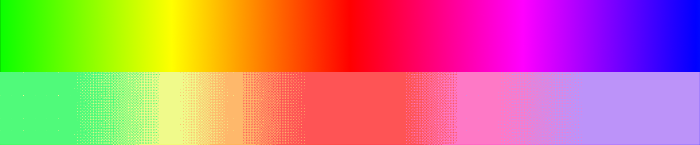
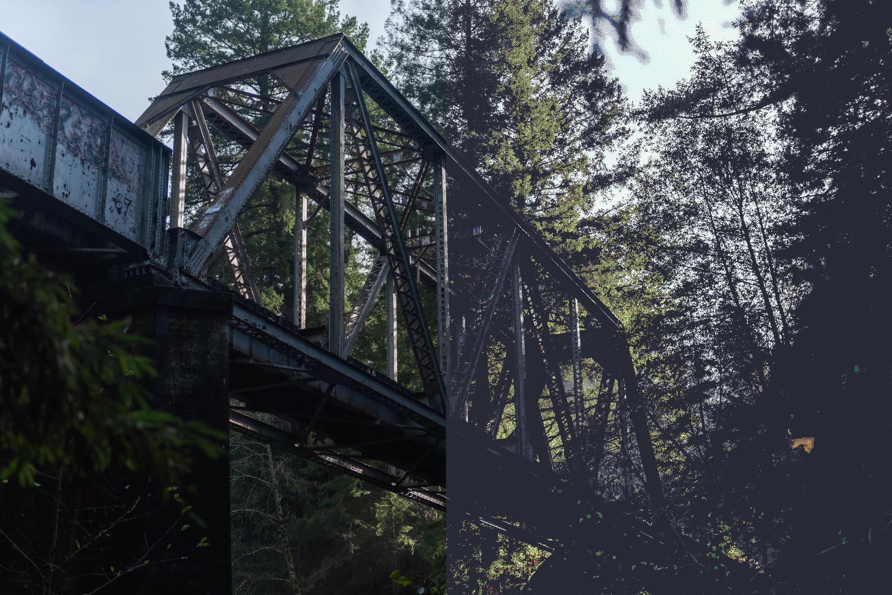
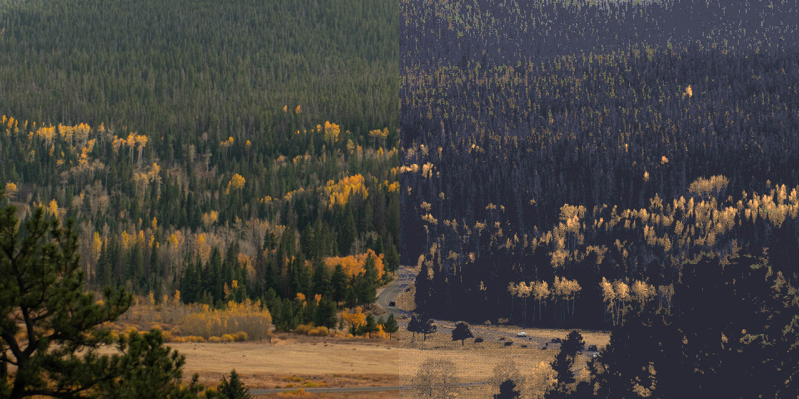
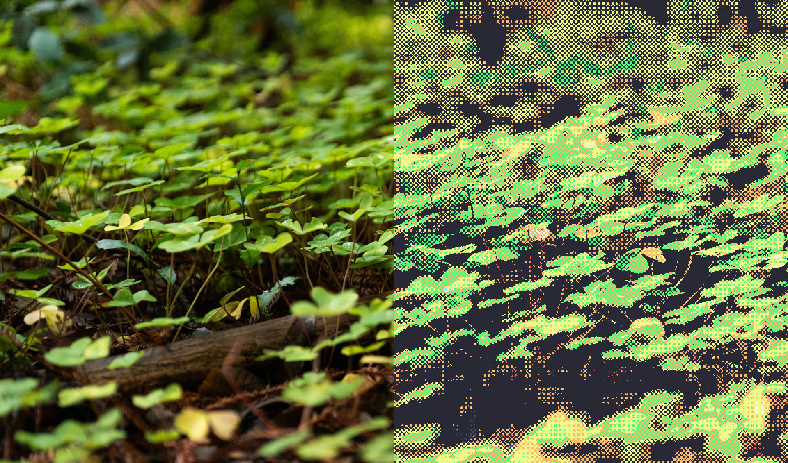

Yes I probably spelled palette wrong

Generates a dithered image from a color palette provided as a png.

Command line:
`color-palette-dither --input-file <input file> --palette-file <palette file> --output-file [out.png]`

It will resize it to 1920x1080, customization will be implented soon

# Examples

All of these are my own photos and dithered using the [dracula](https://draculatheme.com/) color palette.

Best viewing is at full size.

